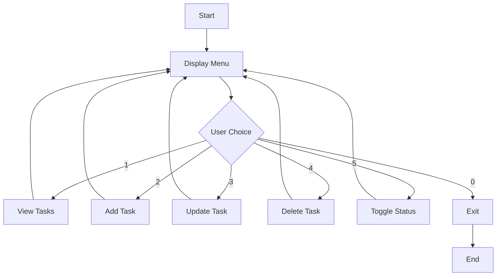

# Specification 001: Phase I - In-Memory Todo Console Application

> **Feature ID**: 001-phase1  
> **Status**: Draft  
> **Created**: 2025-12-07  
> **Author**: Lead Architect (via Spec-Driven Development)

---

## 1. Overview

### 1.1 Purpose
Build a command-line todo application that stores tasks in memory. This is Phase I of the "Evolution of Todo" project, establishing the foundational CRUD operations that will be extended in subsequent phases.

### 1.2 Scope
- **In Scope**: 5 Basic Level features (Add, Delete, Update, View, Mark Complete)
- **Out of Scope**: Persistence, priorities, tags, due dates, recurring tasks (future phases)

### 1.3 Success Criteria
- All 5 features operational via console interface
- Clean code principles followed
- Zero external runtime dependencies
- Spec-driven implementation (no manual coding)

---

## 2. Functional Requirements

### 2.1 FR-001: Add Task

**Description**: Users can create new todo items with a title and optional description.

**Input**:
| Field | Type | Required | Constraints |
|-------|------|----------|-------------|
| title | string | Yes | 1-100 characters, non-empty |
| description | string | No | 0-500 characters |

**Processing**:
1. Validate title is non-empty
2. Generate unique integer ID (auto-increment)
3. Set completed status to `False`
4. Store task in memory

**Output**:
- Success: Display "Task #{id} created: {title}"
- Failure: Display validation error message

**Acceptance Criteria**:
```gherkin
Given the todo list is empty
When I add a task with title "Buy groceries" and description "Milk, eggs"
Then the task is created with ID 1
And the task appears in the list as incomplete
```

---

### 2.2 FR-002: Delete Task

**Description**: Users can remove a task from the list by its ID.

**Input**:
| Field | Type | Required | Constraints |
|-------|------|----------|-------------|
| task_id | integer | Yes | Must exist in storage |

**Processing**:
1. Validate task_id exists
2. Prompt for confirmation: "Delete task #{id}? (y/n)"
3. If confirmed, remove from storage

**Output**:
- Success: Display "Task #{id} deleted"
- Failure: Display "Task #{id} not found"
- Cancelled: Display "Deletion cancelled"

**Acceptance Criteria**:
```gherkin
Given a task with ID 1 exists
When I delete task ID 1 and confirm with 'y'
Then the task is removed from the list
And the task no longer appears when viewing all tasks
```

---

### 2.3 FR-003: Update Task

**Description**: Users can modify the title and/or description of an existing task.

**Input**:
| Field | Type | Required | Constraints |
|-------|------|----------|-------------|
| task_id | integer | Yes | Must exist in storage |
| new_title | string | No* | 1-100 characters if provided |
| new_description | string | No* | 0-500 characters if provided |

*At least one of new_title or new_description must be provided.

**Processing**:
1. Validate task_id exists
2. Display current values
3. Prompt for new values (empty = keep current)
4. Update only provided fields

**Output**:
- Success: Display "Task #{id} updated"
- Failure: Display "Task #{id} not found"

**Acceptance Criteria**:
```gherkin
Given a task with ID 1 has title "Buy groceries"
When I update task ID 1 with new title "Buy groceries TODAY"
Then the task title is changed
And the description remains unchanged
```

---

### 2.4 FR-004: View Task List

**Description**: Users can display all tasks with their status indicators using a Rich Table.

**Input**: None

**Processing**:
1. Retrieve all tasks from storage
2. Sort by ID (ascending)
3. Render using `rich.table.Table` with columns: ID, Status, Title, Description

**Output Format** (Rich Table):
```
┏━━━━┳━━━━━━━━┳━━━━━━━━━━━━━━━━━┳━━━━━━━━━━━━━━━━━━━━━┓
┃ ID ┃ Status ┃ Title           ┃ Description         ┃
┡━━━━╇━━━━━━━━╇━━━━━━━━━━━━━━━━━╇━━━━━━━━━━━━━━━━━━━━━┩
│ 1  │ ❌     │ Buy groceries   │ Milk, eggs          │
│ 2  │ ✅     │ Call mom        │ Birthday wishes     │
│ 3  │ ❌     │ Write report    │ (no description)    │
└────┴────────┴─────────────────┴─────────────────────┘
Total: 3 tasks (1 complete, 2 pending)
```

**Status Icons**:
- ✅ (green) = Complete
- ❌ (red) = Incomplete

- Empty list: Display styled panel "No tasks found. Add one!"

**Acceptance Criteria**:
```gherkin
Given 2 tasks exist (1 complete, 1 incomplete)
When I view the task list
Then I see a Rich Table with correct status icons
And I see the summary count
```

---

### 2.5 FR-005: Mark as Complete/Incomplete

**Description**: Users can toggle the completion status of a task.

**Input**:
| Field | Type | Required | Constraints |
|-------|------|----------|-------------|
| task_id | integer | Yes | Must exist in storage |

**Processing**:
1. Validate task_id exists
2. Toggle completed status (True ↔ False)
3. Update task in storage

**Output**:
- Complete: Display "Task #{id} marked as complete ✓"
- Incomplete: Display "Task #{id} marked as incomplete"
- Failure: Display "Task #{id} not found"

**Acceptance Criteria**:
```gherkin
Given a task with ID 1 is incomplete
When I mark task ID 1 as complete
Then the task status changes to complete
And the list shows [x] for that task
```

---

## 3. Non-Functional Requirements

### 3.1 NFR-001: Performance
- Task operations complete in < 100ms
- Support up to 1000 tasks in memory

### 3.2 NFR-002: Usability
- Menu-driven interface with numbered options
- Clear prompts and feedback messages
- Graceful handling of invalid input

### 3.3 NFR-003: Maintainability
- Modular architecture (models, storage, cli separated)
- Type hints on all public interfaces
- 80%+ test coverage

---

## 4. Data Model

### 4.1 Task Entity

```python
@dataclass
class Task:
    id: int              # Unique identifier (auto-increment)
    title: str           # Task title (required, 1-100 chars)
    description: str     # Task description (optional, 0-500 chars)
    completed: bool      # Completion status (default: False)
    created_at: datetime # Timestamp of creation
```

### 4.2 Storage Interface

```python
class TaskStorage(Protocol):
    def add(self, title: str, description: str = "") -> Task: ...
    def get(self, task_id: int) -> Task | None: ...
    def get_all(self) -> list[Task]: ...
    def update(self, task_id: int, title: str | None, description: str | None) -> bool: ...
    def delete(self, task_id: int) -> bool: ...
    def toggle_complete(self, task_id: int) -> bool: ...
```

---

## 5. User Interface Design

### 5.1 Main Menu (Rich Panel)

The main menu uses `rich.panel.Panel` for a modern look:

```
╭──────────────────────────────────────╮
│     🗒️  TODO CONSOLE - Phase I       │
├──────────────────────────────────────┤
│  [1] 📋 View all tasks               │
│  [2] ➕ Add new task                 │
│  [3] ✏️  Update task                  │
│  [4] 🗑️  Delete task                  │
│  [5] ✔️  Toggle complete/incomplete   │
│  [0] 🚪 Exit                         │
╰──────────────────────────────────────╯
Enter choice: _
```

### 5.2 Interaction Flow



---

## 6. Technical Constraints

### 6.1 From Constitution (Amended)
- Python 3.13+
- UV package manager
- **CLI/UI**: Typer + Rich (required for modern UX)
- In-memory storage only

### 6.2 Project Structure
```
src/
├── __init__.py
├── main.py          # Entry point
├── models.py        # Task dataclass
├── storage.py       # InMemoryStorage class
├── cli.py           # Menu and user interaction
└── exceptions.py    # Custom exceptions
```

---

## 7. Test Scenarios

| ID | Scenario | Expected Result |
|----|----------|-----------------|
| T1 | Add task with valid title | Task created with auto ID |
| T2 | Add task with empty title | Validation error shown |
| T3 | Delete existing task | Task removed from list |
| T4 | Delete non-existent task | Error message shown |
| T5 | Update task title only | Title changed, description unchanged |
| T6 | View empty list | "No tasks found" message |
| T7 | Toggle incomplete to complete | Status changes, indicator updates |
| T8 | Toggle complete to incomplete | Status reverts |

---

## 8. Implementation Notes

### 8.1 For AI Agent (Claude)
- Generate code that strictly follows this specification
- Reference constitution for style guidelines
- Create all files in `src/` directory
- Include comprehensive docstrings
- Add inline comments for complex logic

### 8.2 Verification Checklist
- [ ] All 5 features implemented
- [ ] Menu-driven interface works
- [ ] Error handling for invalid inputs
- [ ] Type hints present
- [ ] Tests cover all scenarios

---

*This specification was created using Spec-Driven Development methodology.*
*Spec-Kit Plus simulation for Hackathon II - Evolution of Todo*
